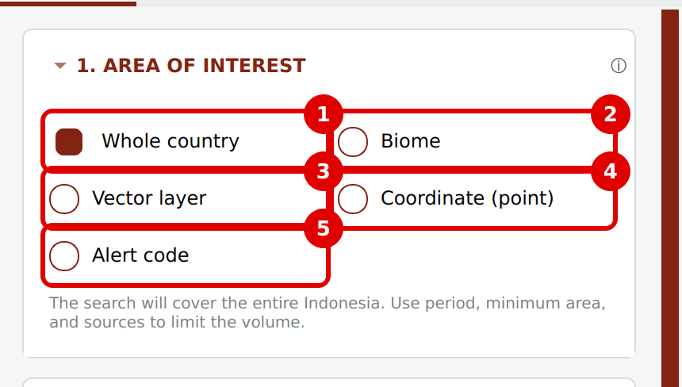
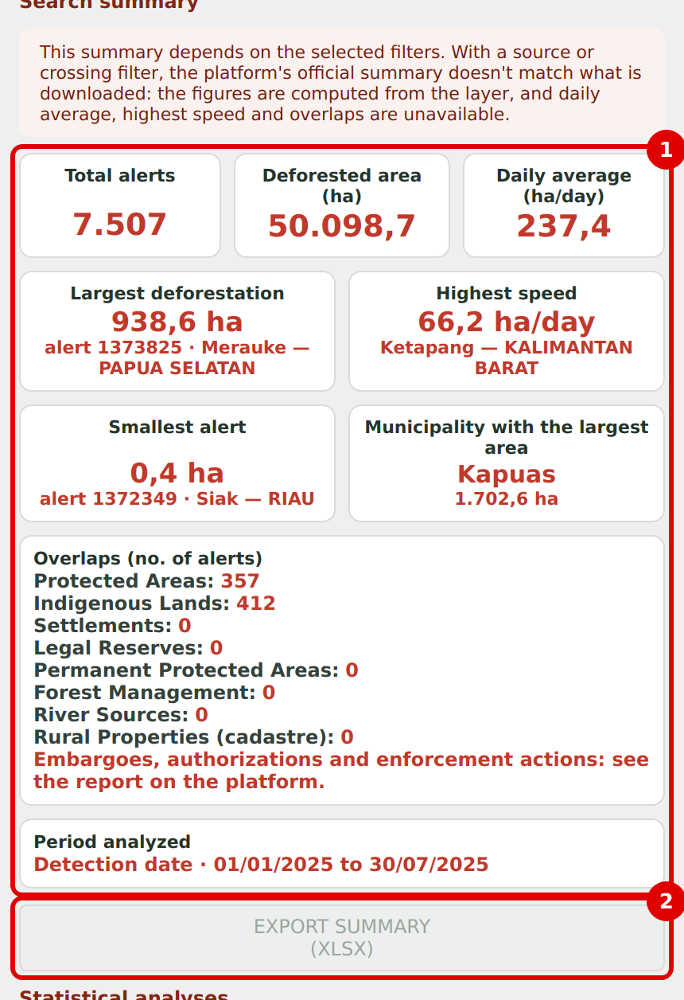
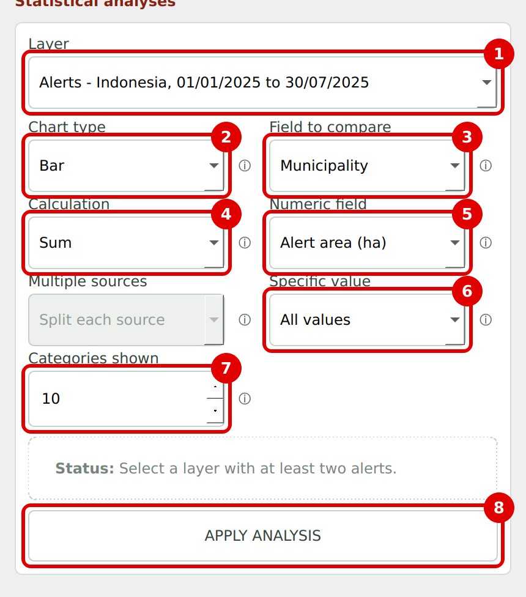
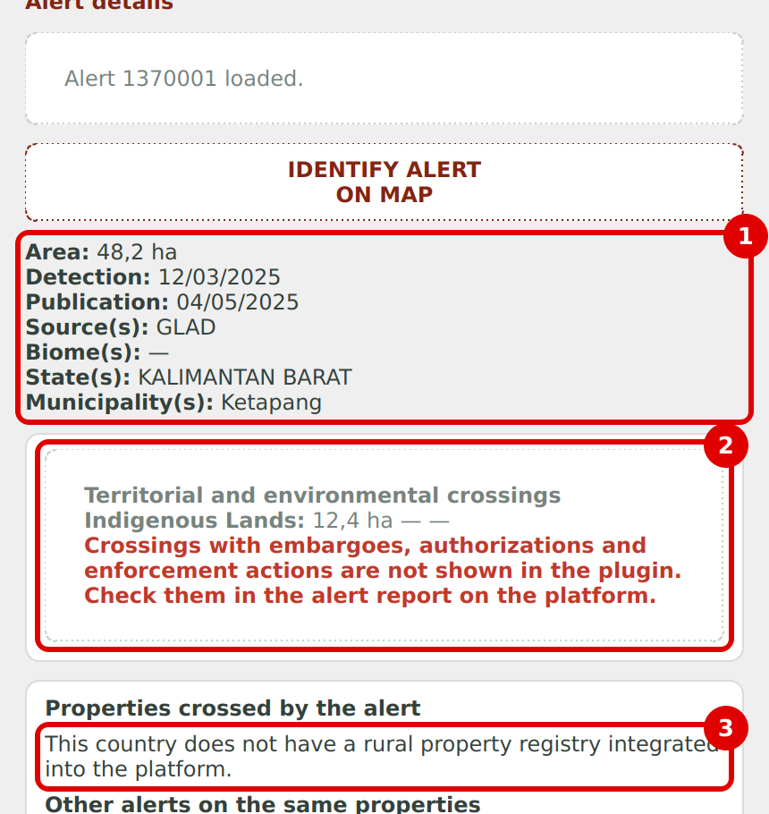

# MapBiomas Alerta Oficial — QGIS plugin

Official QGIS plugin of [MapBiomas Alerta](https://alerta.mapbiomas.org/). It connects to the MapBiomas Alerta GraphQL API (v2) with the user's own platform account and brings validated deforestation alerts into QGIS, where they can be filtered, summarized, charted and exported.

Supported countries: **Brazil, Bolivia, Colombia, Peru and Indonesia**. Interface languages: **Portuguese, Spanish and English**.



## Features

- **Area of interest:** whole country, one or more biomes, a polygon layer already loaded in QGIS, a single coordinate, an alert code or — Brazil only — a rural property (CAR) code.
- **Period:** detection date or publication date, up to one year per search, with quick ranges (last 30 days, 90 days, this year).
- **Filters:** minimum area, detection sources (any / all together / exact combination) and territorial or environmental crossings (with or without a crossing).
- **Search summary:** total alerts, deforested area, daily average, largest and smallest alerts, highest speed, municipality with the largest area, overlaps and analyzed period.
- **Statistical analysis and charts:** bar, pie and line charts by source, biome, region, municipality, date or crossing type, using count, sum or average; enlarged chart window.
- **Alert details:** metadata, crossings, crossed rural properties (Brazil), before/after satellite images and a link to the full report on the platform.
- **Exports:** attribute table (CSV, XLSX), whole layer (GeoPackage, Shapefile), chart (PNG), chart alerts (CSV, GeoPackage, Shapefile) and summary (XLSX).

| Summary | Analysis | Alert details |
|---|---|---|
|  |  |  |

## Requirements

- QGIS 3.22 or later (QGIS 4 compatible).
- Internet access. All data comes from the MapBiomas Alerta API; no data is bundled with the plugin.
- A free account on the MapBiomas Alerta platform of the country you want to query:

| Country | Platform |
|---|---|
| Brazil | https://plataforma.alerta.mapbiomas.org |
| Bolivia | https://plataforma.bolivia.alerta.mapbiomas.org |
| Colombia | https://plataforma.colombia.alerta.mapbiomas.org |
| Peru | https://plataforma.peru.alerta.mapbiomas.org |
| Indonesia | https://platform.idn.alerta.mapbiomas.org |

## Installation

1. In QGIS, open **Plugins › Manage and Install Plugins…**.
2. Select **All** and search for **MapBiomas Alerta**.
3. Select **MapBiomas Alerta Oficial** and click **Install Plugin**.
4. Click the plugin icon on the toolbar (or **Plugins › MapBiomas Alerta Oficial**). The panel opens on the right side of the QGIS window.

If the icon is not visible, enable **View › Toolbars › Plugins Toolbar**, or make sure the plugin is ticked under **Plugins › Manage and Install Plugins… › Installed**.

## Quick start

1. Read and accept the country's information notice.
2. Choose the **country** and **language** at the top of the panel.
3. Open **API access** and sign in with the email and password of your MapBiomas Alerta account.
4. In the **Filters** tab, choose the area of interest and the period, then click **Search alerts**.
5. Use the **Statistics**, **Charts**, **Layers** and **Details** tabs to explore and export the results.

## User guides

Step-by-step guides with screenshots, one per country, in the language used by each platform:

| Country | Guide |
|---|---|
| Brazil (Portuguese) | [docs/user-guides/UserGuide_Brazil_pt.docx](docs/user-guides/UserGuide_Brazil_pt.docx) |
| Bolivia (Spanish) | [docs/user-guides/UserGuide_Bolivia_es.docx](docs/user-guides/UserGuide_Bolivia_es.docx) |
| Colombia (Spanish) | [docs/user-guides/UserGuide_Colombia_es.docx](docs/user-guides/UserGuide_Colombia_es.docx) |
| Peru (Spanish) | [docs/user-guides/UserGuide_Peru_es.docx](docs/user-guides/UserGuide_Peru_es.docx) |
| Indonesia (English) | [docs/user-guides/UserGuide_Indonesia_en.docx](docs/user-guides/UserGuide_Indonesia_en.docx) |

## Country-specific notes

- The rural property (CAR) search is available for Brazil only.
- Biome lists, detection sources and crossing types are loaded from each country's platform after sign-in, so they differ between countries.
- Crossings with embargoes, authorizations and enforcement actions are not shown in the plugin; they are available in the alert report on the platform.

## Repository layout

```
alert_QGIS_plugin/
├── mapbiomas_alerta_oficial/   # plugin source (this folder is what QGIS installs)
├── docs/
│   ├── images/                 # screenshots used in this README
│   ├── user-guides/            # step-by-step guides per country
│   └── PUBLISHING.md           # how to release a new version
├── scripts/
│   └── package_plugin.py       # builds the ZIP uploaded to plugins.qgis.org
├── CHANGELOG.md
└── LICENSE
```

## Building the plugin package

```bash
python scripts/package_plugin.py
```

The script checks the metadata, leaves out caches and hidden files, and writes `dist/mapbiomas_alerta_oficial.<version>.zip`. See [docs/PUBLISHING.md](docs/PUBLISHING.md) for the full release procedure.

## Reporting issues

Please use the [issue tracker](https://github.com/mapbiomas/alert_QGIS_plugin/issues). For account or data questions, write to suporte.alerta@mapbiomas.org.

## Authors

Lana Teixeira and Glauco Munsberg — [MapBiomas](https://mapbiomas.org/).

## License

GNU General Public License v2.0 or later. See [LICENSE](LICENSE).
